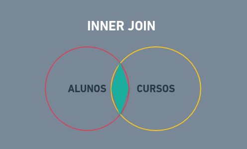
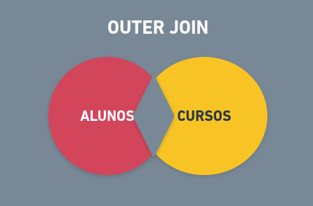
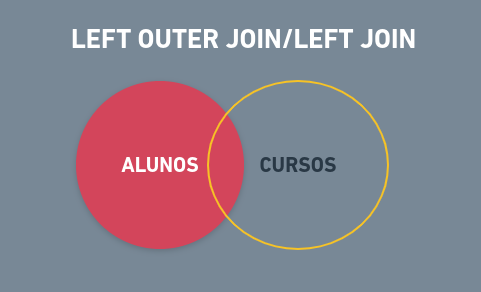
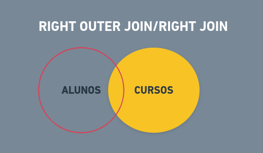
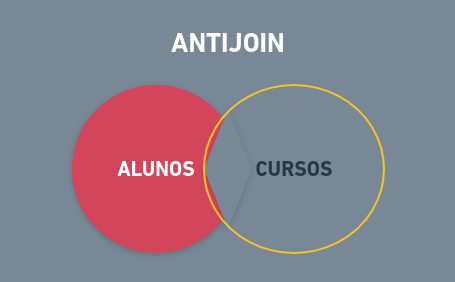

  # Querys Básicas:

- **Criação de uma Base de dados**:
    ```sql
     CREATE DATABASE nome_do_banco_de_dados
    ```
- **Criação de tabelas(Entidades)**:
    ```sql
   CREATE TABLE nome_da_tabela(
      id SERIAL PRIMARY KEY,
      name TEXT,
      avatar_url TEXT,
      email TEXT,
      gender TEXT,
      birth TIMESTAMP,
      blood TEXT,
      weight INTEGER,
      height INTEGER,
  )
    ```
  * Nesse caso acima, **o tipo "serial" já é um tipo que configura o dado (id) como inteiro e com incremento automático pelo banco de dados**. No PostgreSQL, é dito que esse tipo executa 3 configurações de uma vez:
    1. Cria um campo ID com o tipo integer
    2. Cria uma sequence, recurso do PostgreSQL para gerar números sequencias
    3. Definiu a sequence como valor padrão(defalult value) do campo id utilizando a função nextval(), que é responsável por obter o próximo valor de uma sequence. 
  * Além disso, **o exemplo acima por padrão permite que os campos possam ser valores vazios(NULL)**. Caso queira que isso seja mudado, temos que **adicionar a configuração NOT A NULL**:
    ```bash
    $ CREATE TABLE nome_da_tabela(
        id SERIAL PRIMARY KEY,
        name TEXT NOT NULL,
        avatar_url TEXT NOT NULL,
    )
    ```
___
- **Inserção no Banco de dados**:
    ```js
  $ const query = `
  INSERT INTO nome_da_tabela(
    name,
    avatar_url,
    email,
    gender,
    birth,
    blood,
    weight,
    height
  ) VALUES ($1, $2, $3, $4, $5, $6, $7, $8)
  RETURNING id
  `
    ```
  * **É necessário que tudo esteja escrito corretamente**, conforme os campos definidos na tabela.
  * Além disso, após o VALUES, **é o campo em que os valores serão inseridos, e cada número corresponde à um campo da tabela, na ordem posta pelos campos escritos acima**.
  * Ou seja, **name equivale ao $1, avatar_url equivalo ao $2, email equivale ao $3**.
  * Os dados que serão enviados no campo após o VALUES vem com a estrutura, definida após essa inserção, como é dita abaixo:
     ```js
    $ const values = [
        req.body.name,
        req.body.avatar_url,
        req.body.email,
        req.body.gender,
        date(req.body.birth).iso,
        req.body.blood,
        req.body.weight,
        req.body.height
    ]
     ```
    * **req.body.name é o valor inserido no $1, req.body.avatar_url é o valor inserido no $2, req.body.email é o valor inserido no $3 e assim sucessivamente**.   
    * Portanto, é necessário que **as ordens dos valores correspondam com as ordens dos campos na query de inserção**.
    * Por fim, caso quisessemos alterar ou modificar algum dado para assim, então, salvar no banco de dados, poderiamos aplicar alguma função que criassemos nesse útlimo campo do array values, como fizemos com a função date().iso
- Por fim, para a inserção ocorrer, é necessário que importemos o arquivo db, que contém as credenciais do banco de dados e utilizemos a função de inserção:
   
   
    ```js
      $ db.query(query, values, function(err, results){
          console.log(err)
          console.log(results)
          callback(results.row[0])
      }) 
    ```
 
  * Nessa função, como parâmetros temos:
    * A query: que **é a estrutura SQL para inserção no banco de dados explicada anteriormente**
    * O array values que **contém os dados advindos do req.body**(da página de cadastro em si)
    * Uma função callback que **passara os parâmetros:**
      *  **err**: Responsável por armazenar algum erro, caso ocorra. 
      * **results**: É o resultado da inserção no banco de dados, esse resultado contém os novos dados inseridos e outras informações dessa inserção
  * Além disso há os consoles.logs que são opcionais justamente para imprimir os erros ou resultados caso queira.
  * O **results.row[0] é somente o novo dado inserido, ele é passado na função callback que retornará esse novo valor inserido lá no arquivo de controles em que é necessário desse novo dado para redirecionar o usuário para a página members/members.id**, ou seja, para a página do novo membro, novo dado criado, com isso é necessário o id desse novo dado que vem por meio da callback
___
- **Buscando dados no banco**:
  
  * **Listagem de todos os dados de uma tabela, ou seja, listagem de todas instâncias de uma Entidade:**   
    ```js
    all(callback){
      db.query(`SELECT * FROM nome_da_tabela`,function(err, results){
      if(err) throw `Database Error`
      callback(results.row)
     })
    }
    ```
    * O **símbolo * seleciona todos os instrutores da tabela** de instrutores no banco de dados
    * **Não precisa do campo values**, pois **não há nenhum placeholder para ser substituído** na query em si.
    * Se um erro ocorre, o **if é acionado e com a função throw lança o erro na tela junto com a string passada e para o código**
    * **results.rows representa todos os dados que foram buscados no banco de dados, no caso é um array dos elementos buscandos na tabela**. Todos esses dados são passsados na callback pois serão retornados lá no arquivo de controles para ser renderizada a página de listagem com todos esses dados buscados no banco de dados.
    * Essa query é feita dentro dessa função all, pois está modularizada em um arquivo só de querys, em que esses retornaram informações do banco de dados para o módulo de controle, das funções index, post, put e delete.
  * **Buscando somente 1 instância na tabela**:
    ```sql
    `
      SELECT * FROM nome_da_tabela WHERE id = 1
    `
    ou
    `
     SELECT * FROM nome_da_tabela WHERE name = 
     Lucas
    `
    ou
    `
    SELECT * FROM nome_da_tabela WHERE idade =  22
    `
    ```
  
    * Nesse caso, estamos primeiro **selecionando todos os dados da tabela e depois filtrando esses dados ou pelo id, ou pelo nome, ou pela idade**. Ou seja, podemos selecionar todos os dados e filtrar aqueles que queremos por meio dos atributos/propriedades dos instâncias.

___

- **Atualizando 1 instância específica na tabela**:
  ```sql
    `
    UPDATE nome_da_tabela SET
      name = ($1),
      avatar_url = ($2),
      email = ($3),
      gender = ($4),
      birth = ($5),
      blood = ($6),
      weight = ($7),
      height = ($8)
    WHERE id = $9
    `
  ```
   * Após isso, **segue a mesma lógica de salvar dados na tabela construindo o vetor dos valores(values) e depois o método db**.query, com a única diferença que a função callback não retornará nada, não será usado nehum dado que foi inserido para redirecionar a página ou imprimir na página após salvar a atualização.
   
      **Não passaremos callback com o id** do dado atual para redirecionar a página, **pois o id que será passado pela URL(params) para o redirect direto no arquivo de controles**, então
      basta salvar os novos dados normalmente.
___
- **Deletando dados(1 instância da tabela) da tabela**:
  ```sql
  delete(id, callback){
     db.query(`DELETE FROM nome_da_tabela WHERE id = $1`, [id], function(err, results){
       if(err) throw `Database erro! ${err}`
    
      })
    }
  ```
 - **Ordenação das instâncias da tabela**:
    ```sql
      SELECT * FROM nome_da_tabela ORDER BY name ASC
    ```
    ```sql
     SELECT * FROM nome_da_tabela ORDER BY id ASC
    ```
    ```sql
     SELECT * FROM nome_da_tabela ORDER BY weight DESC
    ```

    ```sql
     SELECT * FROM nome_da_tabela ORDER BY height DESC
    ```
    * A ordenação é feita por meio do comando ORDER BY que é aplicado após a seleção das instâncias desejadas(nesse caso todas) em conjunto com algum atributo da instância será o que determinará a ordenação.
    * Nos exemplos acima, utilzamos a ordenação **por meio do nome**, ou por meio da **altura**, **largura** ou **id**. Além disso é necessário informar como será a ordenação, se será **decrescente(DESC) ou crescente(ASC)**.


## Relacionamentos:
 - ### Método Join:
    * Responsável por construir os relacionamentos no SQL. Ou seja, obtem dados provenientes de 2 ou mais tabelas, baseado em um relacionamento entre colunas nestas tabelas.
      EXEMPLO: 2 entidades, alunos e cursos
    
    * **INNER JOIN**: INTERSEÇÃO/JUNÇÃO
      * Retorna somente os dados da Interseção de 2 Entidades(Tabelas), ou seja, aqueles que possuem correspondência entre as 2 tabelas.
      * Ex: Alunos que possuem cursos e cursos que possuem alunos:
        <div align="center" ></div> 
     
      * ALGORITMO:
          ```sql
            SELECT ALL colunas FROM tabela1
            INNER JOIN tabela2
            ON tabela1.coluna = tabela2.coluna
          ```
      * SQL:
          ```sql
            SELECT * FROM alunos
            INNER JOIN cursos
            ON alunos.ID_curso = cursos.ID_curso
          ```
          ```sql
            SELECT * FROM members
            INNER JOIN instructors
            ON members.instructor_id = instructors.id
          ```
          ```sql
           SELECT members.name, members.gender, members.weight, members.height, members.instructor_id, instructors.name, instructors.gender, instructors.id FROM members
           INNER JOIN instructors
           ON members.instructor_id = instructors.id
          ```
      * Ou seja:
        ```bash
          Selecione todas instâncias da Entidade alunos 
          em conjunto com os instâncias da Entidade cursos,
          em que, a coluna de id do curso das instâncias da Entidade Alunos seja igual ao id das instâncias das instâncias da Entidade Cursos
        ```

    * **OUTER JOIN**: "FORA"
      * Retorna somente as instâncias das tabelas(Entidades) mesmo se não possuem correspondência com a outra tabela(Entidade).
      * Ex: Todos os alunos e Cursos que não possuem associação entre si, ou seja, todos aqueles fora da interseção(Todos os alunos que não possuem cursos e todos os cursos que não possuem alunos)
        <div align="center" ></div> 
    
    * **LEFT JOIN/LEFT OUTER JOIN**: INTERSEÇÃO + LADO ESQUERDO
      * Retorna os elementos do lado esquerdo da união entre as 2 tabelas mais os elementos da interseção, aqueles que estão se relacionando. Ou seja retornará dados da esquerda mesmo se não houver correspondência com alguma dado da direita.
      * Todos os elementos do lado esquerdo ou seja, todos os alunos que não possuem curso(nesse caso são os alunos que estão do lado esquerdo, mas poderia ser os cursos caso esse estivessse também no lado esquerdo), mais todos os alunos que possuem cursos, ou seja, mais a interseção.
        <div align="center" ></div> 
      * ALGORITMO:
          ```sql
            SELECT ALL colunas FROM tabela1(left)
            LEFT JOIN tabela2(right)
            ON tabela1.coluna = tabela2.coluna
          ```
      * SQL:
          ```sql
            SELECT * FROM alunos
            LEFT JOIN cursos
            ON alunos.ID_curso = cursos.ID_curso
          ```
          ```sql
            SELECT * FROM members
            LEFT JOIN instructors
            ON members.instructor_id = instructors.id
          ```
          ```sql
            SELECT instructors.*, count(members) AS total_students
            FROM instructors
            LEFT JOIN members
            ON (members.instructor_id = instructors.id)
            GROUP BY instructors.id
            ORDER BY total_instudents
   
            'Nesse caso, estamos selecionando todas colunas dos instrutores(tabela a esquerda), criando um contador de membros para cada instância Instrutor,
            realizando o left join 
            e agrupando os membros via instructor.id.
            Além disso, ordenamos os instrutores pela quantidade de membros que cada um possui'
          ```

    * **RIGHT JOIN/RIGHT OUTER JOIN**: INTERSEÇÃO + LADO DIREITO
      * Retorna somente os elementos do lado direito da união entre as 2 tabelas mais os elementos da interseção. OU Seja,retorna todos as instâncias do lado direito mesmo se não houver alguma correspondência com o lado esquerdo.
      * Todos os elementos do lado direito ou seja, todos os cursos que não possuem alunos(nesse caso são os cursos que estão do lado direito, mas poderia ser os alunos caso esse estivessse também nesse lado), mais todos os cursos que possuem alunos, ou seja, mais a interseção.
        <div align="center" ></div> 
      * ALGORITMO:
          ```sql
            SELECT ALL colunas FROM tabela1(left)
            RIGHT JOIN tabela2(right)
            ON tabela1.coluna = tabela2.coluna
          ```
      * SQL:
          ```sql
            SELECT * FROM alunos
            RIGHT JOIN cursos
            ON alunos.ID_curso = cursos.ID_curso
          ```
          ```sql
            SELECT * FROM members
            RIGHT JOIN instructors
            ON members.instructor_id = instructors.id
            'Nesse caso, retornará primeiro a tabela de membros e depois a tabela de insturtores assim como foi acima, com o left join.No entando, no left join, temos apenas os intrutores que estão relacionados aos membros já que estamos no left, e a tabela a esquerda é a de membros, então queremos só os membros e instrutores que estejam relacionados a algum membro.
            Mas, no right join, temos que, queremos os instrutores e somente os membros que estão relacionado aos instrutores, ou seja, terá todos instrutores, até mesmo aqueles que não estão correlacionados com nenhum membro!'
          ```
    * **FULL JOIN**: TUDO!.
    * Retorna todos os elementos do lado esquerdo, que não possuem associação com o lado direito, mais todos os elementos do lado direito, que não possuem associação o lado esquerdo, mais a interseção dos elementos que se relacionam. Ou seja, retorna os elementos que se relacionam e os que não se relacionam das 2 tabelas(direita e esquerda)
    * Ex: Retorna todos os alunos que não possuem cursos, todos os cursos que não possuem alunos e todos os alunos que possuem cursos e todos os cursos que possuem alunos

      * ALGORITMO:
          ```sql
            SELECT ALL colunas FROM tabela1(left)
            FULL JOIN tabela2(right)
            ON tabela1.coluna = tabela2.coluna
          ```
      * SQL:
          ```sql
            SELECT * FROM alunos
            FULL JOIN cursos
            ON alunos.ID_curso = cursos.ID_curso
          ```
          ```sql
            SELECT me.id, me.name, me.gender, me.weight, me.instructor_id,ins.id, ins.name FROM members AS me
            FULL JOIN instructors AS ins
            ON me.instructor_id = ins.id
            'Retornando as colunas passadas tendo a relação ou não'
          ```
          ```sql
            SELECT me.id, me.name, me.gender, me.weight, me.instructor_id,ins.id, ins.name FROM members AS me
            FULL JOIN instructors AS ins
            ON me.instructor_id = ins.id
            WHERE me.id IS NULL OR ins.id IS NULL
            'Retornando somente os dados das instâncias que possuem ou o me.id vazio ou o ins.id vazio'
          ```
    *  **SEMI JOIN**: DADOS ESPECÍFICOS DA INTERSEÇÃO
       *  Dados específicos de uma interseção entre 2 tabelas/entidades.
       * No caso, esses dados específicos são de alguma das 2 tabelas, mas somente aqueles que estão na associação com outra tabela.
       * Ou seja, por exemplo, todos os nomes e emails dos alunos que possuem cursos(ou seja, nomes e emails somente dos alunos que estão na interseção)
     
     * **ANTI JOIN**: DADOS ESPECÍFICOS DE ELEMENTOS QUE NÃO ESTÃO NA INTERSEÇÃO
       * No caso, esses dados específicos são de alguma das 2 tabelas, mas somente aqueles que NÃO estão na associação com outra tabela.
       * Ex: Todos os nomes e emails dos alunos que NÃO possuem cursos(ou seja, nomes e emails somente dos alunos que estão FORA DA INTERSEÇÃO)
          <div align="center"></div> 


```json
{   
    "ignore": ["*.json"] 
}
```
- Isso previne o projeto de ficar em loop de carregamento "infinito" no navegador quando uma mudança for feita no arquivo json de dados.
___
Desenvolvido por :star2: Lucas de Lima Martins de Souza.
